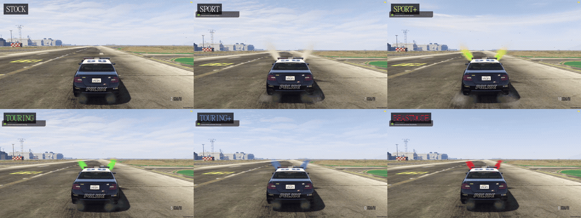

# 🚔 ResGuard PursuitMode

Advanced vehicle performance tuning and visual purge system for FiveM.



---

## 🌟 Features

- **5 High-Performance Pursuit Modes**:
  - `Sport` (+30 km/h, White Xenon)
  - `Sport+` (+45 km/h, Yellow Xenon)
  - `Touring` (+60 km/h, Neon Green Xenon)
  - `Touring+` (+75 km/h, Blue Xenon)
  - `BeastMode` (+90 km/h, Red Xenon)
- **Synchronized Visual & Audio Effects**:
  - Twin hood purge steam / nitrous spray effects synchronized across all players via server networking.
  - Automatic Xenon headlight color matching for each active mode.
- **True Standalone & Zero-Setup Framework Auto-Detection**:
  - Works out of the box with **ESX**, **QBCore**, and **Qbox**.
  - Automatically detects the active framework without requiring any changes in `config.lua`.
  - Works standalone if no framework is present.
- **Engine Failsafe Protection**:
  - Vehicle automatically reverts to stock handling if engine health drops below critical threshold (e.g. heavy crash).
- **Anti-Spam Cooldown Protection**:
  - 2-second cooldown prevents command/key spam and lets visual purge animations complete cleanly.
- **Job & Vehicle Whitelisting**:
  - Configure authorized job roles, minimum ranks, and specific emergency vehicle models.

---

## 🎮 Controls & Commands

- **Chat Commands**:
  - `/pursuitmode` (Default primary command)
  - `/pursuit` (Built-in alias)
  - `/pursuitmod` (Built-in alias)
- **Keybind**:
  - Default: `G` (Fully customizable in GTA Settings ➔ Key Mappings ➔ FiveM)

---

## 📦 Installation

1. Download or clone this repository:
   ```bash
   git clone https://github.com/ResGuard-Scripts/ResGuard-PursuitMode.git
   ```
2. Put `ResGuard_PursuitMode` into your server's `resources` directory.
3. Add the following to your `server.cfg`:
   ```cfg
   ensure ResGuard_PursuitMode
   ```
4. Customize jobs, whitelisted vehicles, or tuning parameters in `config.lua` if desired.

---

## 🛠️ Developer Exports

### Client
```lua
-- Get active pursuit mode level (0 = Stock, 1-5 = Active Mode)
local mode = exports['ResGuard_PursuitMode']:GetPursuitMode(vehicle)

-- Programmatically cycle to the next pursuit mode
exports['ResGuard_PursuitMode']:CyclePursuitMode()
```

### Server
```lua
-- Get pursuit state for vehicle entity
local state = exports['ResGuard_PursuitMode']:GetVehiclePursuitState(vehNetId)
```

---

## 💬 Community & Support

Join the official ResGuard community for updates, support, and more free scripts:
- **Discord**: [https://discord.gg/JFsWSJbND](https://discord.gg/JFsWSJbND)

---
*Created with ❤️ by **ResGuard Development**.*